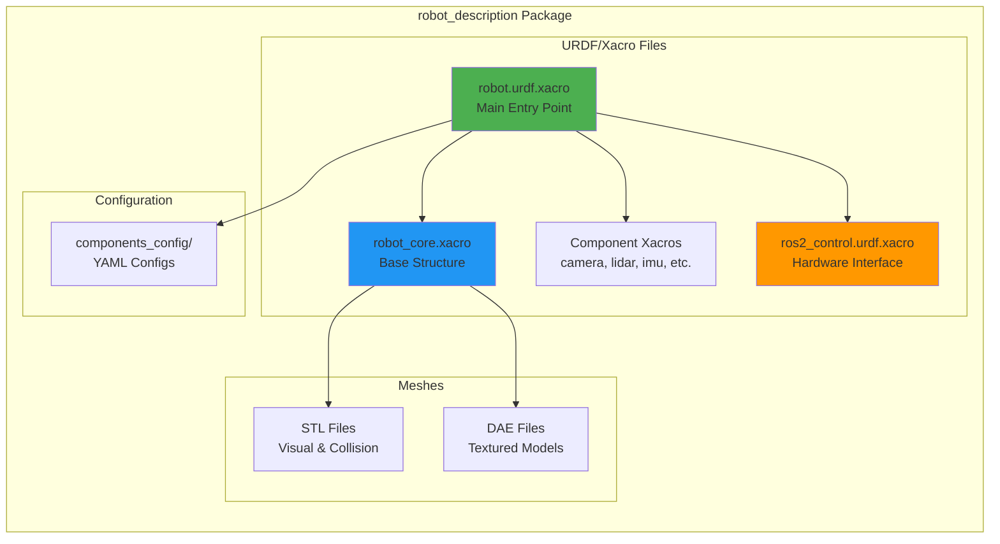
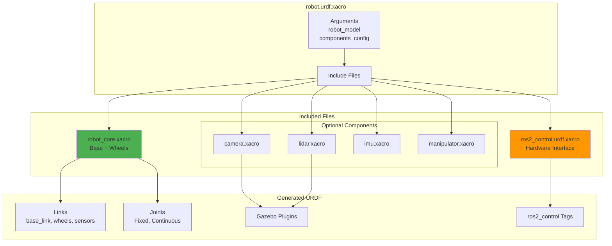
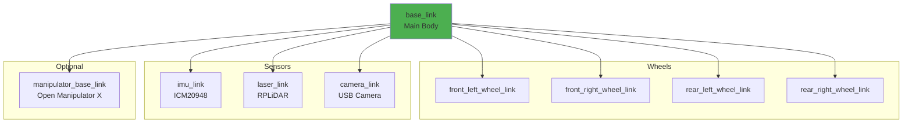
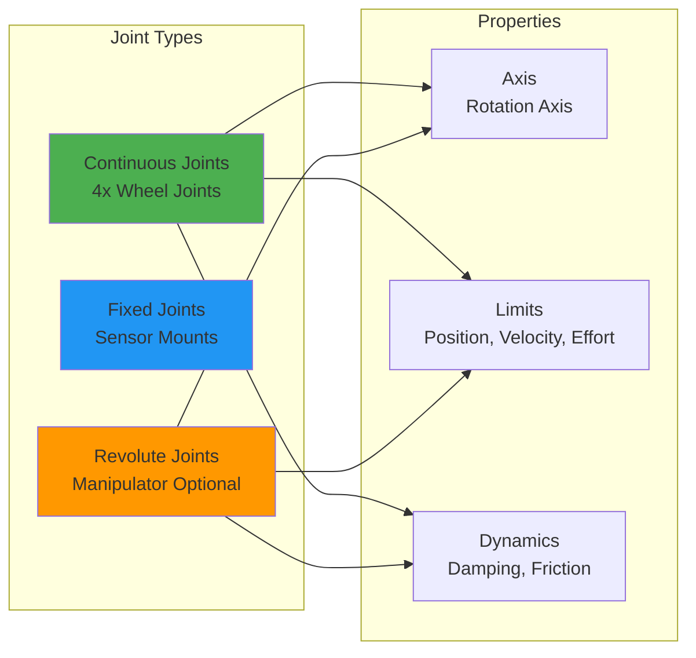
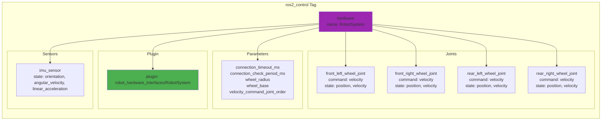
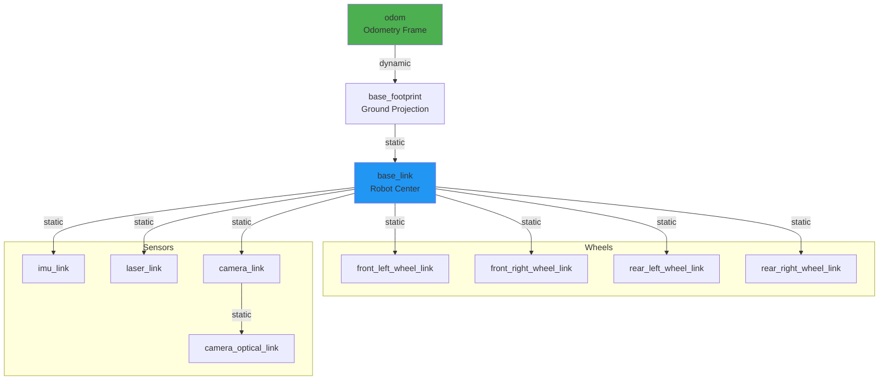
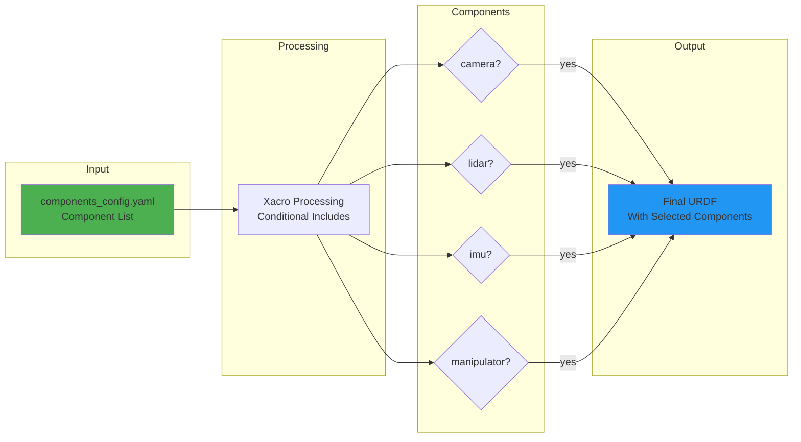
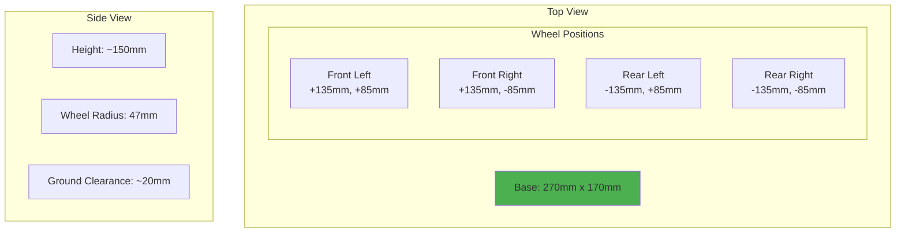
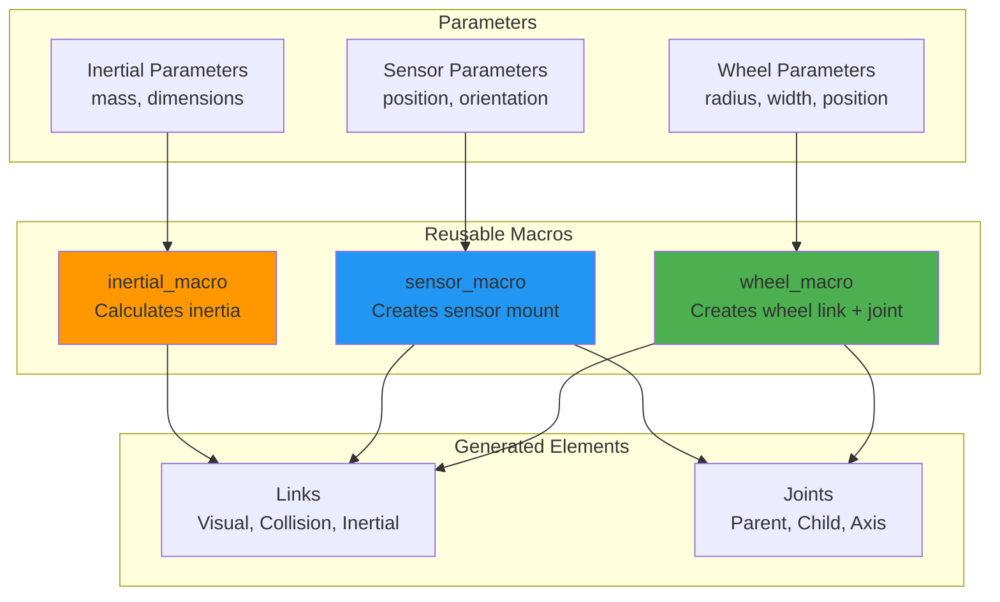
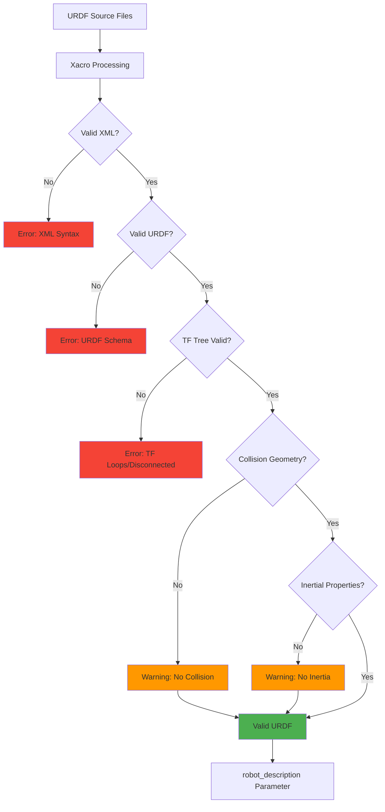

# robot_description Architecture

## Overview

This package contains the URDF/xacro robot model definitions, meshes, and component configurations for the robot_xl platform.

## Package Structure



## URDF Structure



## Link Hierarchy



## Joint Types



## ros2_control Configuration



## Coordinate Frames (TF Tree)



## Gazebo Integration

```mermaid
graph TB
    subgraph "Gazebo Plugins"
        direction TB
        
        RC_PLUGIN[gazebo_ros2_control<br/>Hardware Interface]
        
        subgraph "Sensor Plugins"
            LIDAR_PLUGIN[gazebo_ros_ray_sensor<br/>LiDAR]
            CAM_PLUGIN[gazebo_ros_camera<br/>Camera]
            IMU_PLUGIN[gazebo_ros_imu_sensor<br/>IMU]
        end
    end
    
    subgraph "ROS2 Topics"
        SCAN[/scan<br/>LaserScan]
        IMG[/camera/image_raw<br/>Image]
        IMU_DATA[/imu/data<br/>Imu]
    end
    
    RC_PLUGIN -->|simulates| HWI[Hardware Interface]
    LIDAR_PLUGIN --> SCAN
    CAM_PLUGIN --> IMG
    IMU_PLUGIN --> IMU_DATA
    
    style RC_PLUGIN fill:#4CAF50
    style LIDAR_PLUGIN fill:#2196F3
    style CAM_PLUGIN fill:#FF9800
    style IMU_PLUGIN fill:#9C27B0
```

## Component Configuration Flow



## Physical Properties

### Robot Dimensions (robot_xl)



### Mass Properties

| Component | Mass (kg) | Inertia |
|-----------|-----------|---------|
| Base Link | 2.5 | Calculated from box |
| Wheel (each) | 0.1 | Calculated from cylinder |
| IMU | 0.01 | Negligible |
| Camera | 0.05 | Negligible |
| LiDAR | 0.2 | Calculated from cylinder |

## Xacro Macros



## URDF Validation



## Usage Examples

### Load URDF
```bash
ros2 launch robot_description load_urdf.launch.py \
  robot_model:=robot_xl \
  components_config:=$(ros2 pkg prefix robot_description)/config/robot_xl/basic.yaml
```

### Visualize in RViz
```bash
ros2 launch robot_description view_robot.launch.py
```

### Check URDF
```bash
check_urdf robot.urdf
```

### View TF Tree
```bash
ros2 run tf2_tools view_frames
```

### Generate URDF from Xacro
```bash
xacro robot.urdf.xacro robot_model:=robot_xl > robot.urdf
```

## Configuration Files

### components_config.yaml

**Purpose**: Define which components to include in robot model

**Example**:
```yaml
components:
  - type: camera
    enabled: true
    position: [0.1, 0.0, 0.15]
  
  - type: lidar
    enabled: true
    position: [0.0, 0.0, 0.2]
  
  - type: imu
    enabled: true
    position: [0.0, 0.0, 0.05]
  
  - type: manipulator
    enabled: false
```

## Dependencies

- **xacro**: URDF macro processing
- **robot_state_publisher**: TF tree publishing
- **joint_state_publisher**: Joint state management (for testing)
- **urdf**: URDF parsing and validation
- **husarion_components_description**: Component xacro files (optional)

## Troubleshooting

| Issue | Possible Cause | Solution |
|-------|---------------|----------|
| URDF fails to load | Syntax error in xacro | Check xacro syntax, validate XML |
| TF tree disconnected | Missing joint | Check all links have parent joints |
| Robot appears wrong in RViz | Wrong mesh paths | Verify mesh file paths are correct |
| Gazebo crashes | Invalid inertial properties | Check mass and inertia values |
| Controllers fail | Wrong joint names | Verify joint names match controller config |
| No visualization | Missing meshes | Check mesh files exist in package |
